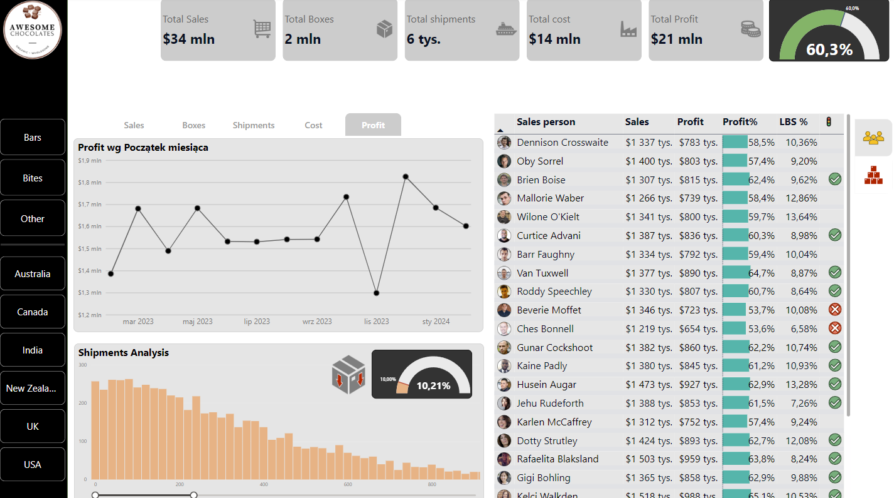
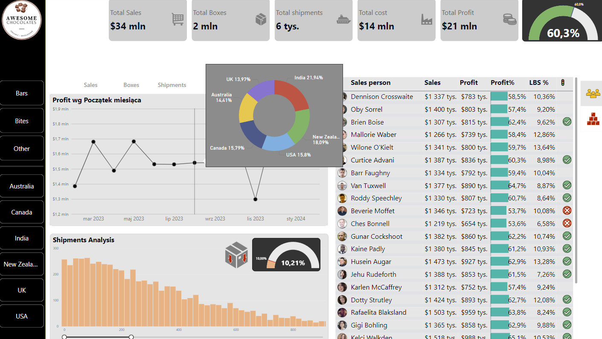

# Chocolate Business Dashboard / Panel Biznesowy Czekolady

## 📊 Opis projektu / Project Description
Ten projekt zawiera dashboard analityczny dotyczący biznesu czekoladowego, stworzony w Power BI. Dashboard umożliwia analizę sprzedaży, trendów rynkowych oraz innych kluczowych wskaźników biznesowych.

This project includes an analytical dashboard related to the chocolate business, created in Power BI. The dashboard enables the analysis of sales, market trends, and other key business indicators.

## 🖼️ Podgląd dashboardu / Dashboard Preview
[Link do dashboardu](TU_WSTAW_LINK) / [Dashboard Link](INSERT_LINK_HERE)

## 📁 Zawartość repozytorium / Repository Contents

- **1.png, 2.png** – Zrzuty ekranu dashboardu. / Dashboard screenshots.
- **icons/** – Folder z ikonami używanymi w dashboardzie. / Folder with icons used in the dashboard.
- **Chocolate Business.pbix** – Plik raportu Power BI. / Power BI report file.
- **ac-sample-data.xlsx** – Przykładowe dane używane w analizie. / Sample data used for analysis.
- **README.md** – Niniejszy plik README. / This README file.

## 🔍 Opis danych / Data Description
Dane zawarte w repozytorium obejmują informacje o sprzedaży, produktach i trendach rynkowych w branży czekoladowej. Wykorzystano je do stworzenia interaktywnego dashboardu w Power BI.

The data in the repository includes information on sales, products, and market trends in the chocolate industry. It has been used to create an interactive Power BI dashboard.

## 📢 Jak używać? / How to Use?
1. Pobierz plik **Chocolate Business.pbix**. / Download the **Chocolate Business.pbix** file.
2. Otwórz go w **Power BI Desktop**. / Open it in **Power BI Desktop**.
3. Przeglądaj i analizuj dane na interaktywnym dashboardzie. / Explore and analyze data using the interactive dashboard.

## 📌 Wymagania / Requirements
- Power BI Desktop
- Podstawowa znajomość analizy danych / Basic knowledge of data analysis

## 🏆 Autor / Author
Projekt został stworzony w celu analizy i wizualizacji danych biznesowych. Jeśli masz pytania, skontaktuj się za pośrednictwem GitHuba.

This project was created for the analysis and visualization of business data. If you have any questions, feel free to reach out via GitHub.

---
Dziękujemy za zainteresowanie naszym projektem! 🚀 / Thank you for your interest in our project! 🚀

